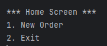
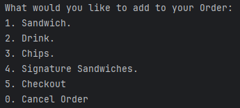
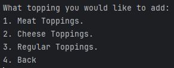

🥪 Welcome to the Sandwich Shop Console Application!
This application simulates a full-featured sandwich ordering system built using Java. It allows users to fully customize their sandwich orders — choosing bread types, sandwich sizes, toppings (meats, cheeses, and regular toppings), sauces, and sides — with real-time price calculation and a detailed receipt upon checkout. Great for demonstrating object-oriented principles, user interaction via the CLI, and Java collection handling.

---

  
🧾 README FILE MENU

  

    
🛠 Technologies Used

  * Java 17+
  * File I/O
  * Collections API
  * Java Time API

  

  

    
🧠 Features

  #### 🏠 Home Screen
  * New Order
  * Exit

  #### 📋 Order Menu
  * Add Sandwich  
    * Bread (type, size)  
    * Meat Toppings  
    * Cheese Toppings  
    * Regular Toppings  
    * Sauces  
    * Sides  
    * Toasted (yes/no)  
  * Add Drink  
  * Add Chips  
  * Signature Sandwiches  
  * Checkout  
  * Cancel Order  
  
  

  
💻 Application Interface

  ### Home Screen: 
  

  ### Order Screen:
  
  
  ### Topping Screen:
  
   
  

  

    
📂 File Structure

  

    
🧱 builders

  * 🛠️ `OrderBuilder.java`  
  * 🧰 `SandwichBuilder.java`  
  * 👨‍🍳 `SignatureSandwich.java`
  * 🧑‍🍳 `SignatureSandwichCustomize.java`

  

  

    
🧩 enums

  * 🧩 `BreadSize.java`

  

  

    
📝 filemanager

  * 🧾 `ReceiptFileManager.java`

  

  

    
📦 modele

  * 🍞 `Bread.java`  
  * 🧀 `CheeseTopping.java`  
  * 🧺 `Chips.java`  
  * 🧃 `Drink.java`  
  * 🥓 `MeatTopping.java`  
  * 🧾 `Order.java`  
  * 🥬 `RegularTopping.java`  
  * 🥪 `Sandwich.java`  
  * 🧂 `Sauce.java`  
  * 🍟 `Sides.java`   
  * 🧩 `Topping.java` (abstract base class)

  

  

    
🖥️ ui

  * 🏠 `HomeScreen.java`  
  * ▶️ `Main.java`

  

  

    
🧪 Testing

  * Unit tests can be added using **JUnit 5**.
  * Focus areas include:
    * Sandwich price calculation logic
    * Topping selection and validation
    * Order total correctness
    * File output via `ReceiptFileManager`
  
  

  

### 👤 Author
Stanislav Hryshchuk 
